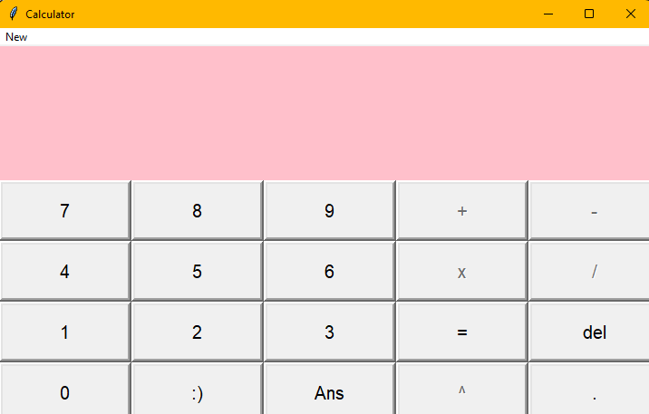
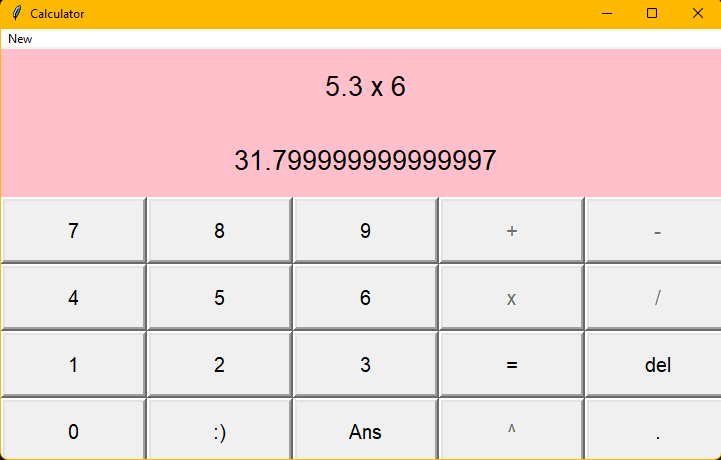
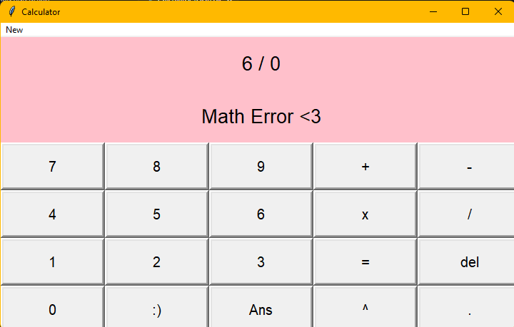

# CalculatorGUI-tkinter



## Description

This is a simple calculator application built using Python and the Tkinter library. It allows users to perform basic arithmetic operations such as addition, subtraction, multiplication, division, and exponentiation. The calculator also includes a memory feature to store and recall previous results using the "Ans" button. The user-friendly graphical interface makes it easy to perform calculations.

## Table of Contents

- [Getting Started](#getting-started)
- [Usage](#usage)
- [Screenshots](#screenshots)
- [Contributing](#contributing)
- [Acknowledgments](#acknowledgments)
- [Contact](#contact)

## Getting Started

To run the calculator app on your local machine, follow these steps:

1. Clone this repository:
```bash
git clone https://github.com/yourusername/calculatorGUI-tkinter.git
```
2. Navigate to the project directory:
```bash
cd calculatorGUI-tkinter
```
3. Run the Python script:
```bash
python calculator.py
```

## Usage

1. Enter your mathematical expression in the input field.
2. Click the "=" button to calculate the result.
3. Use the "Ans" button to recall the previous result.
4. Click "del" to delete the last character in the input field.

## Screenshots




## Contributing

If you'd like to contribute to this project, please fork the repository and create a pull request. Contributions are welcome!

## Acknowledgments

- Special thanks to the Tkinter library for providing the graphical user interface.
